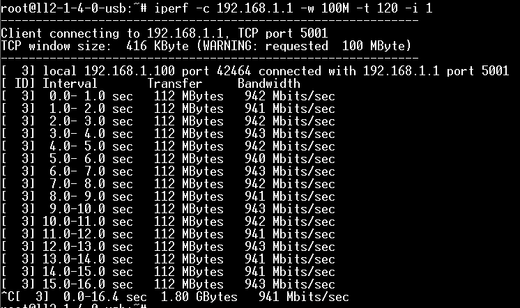
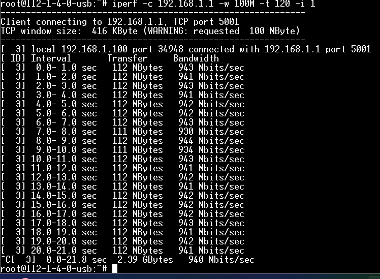
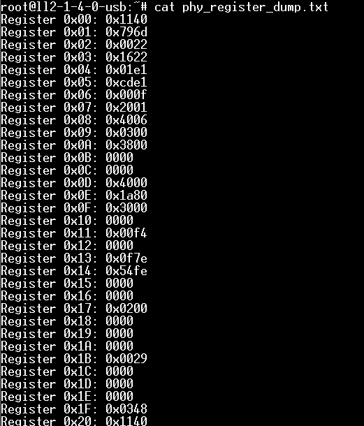
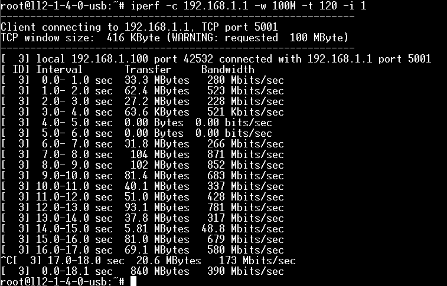
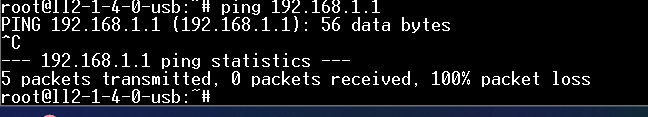
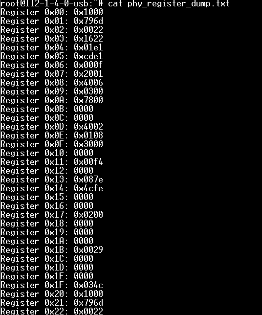
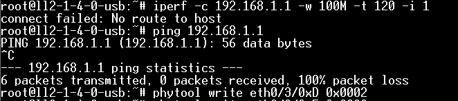
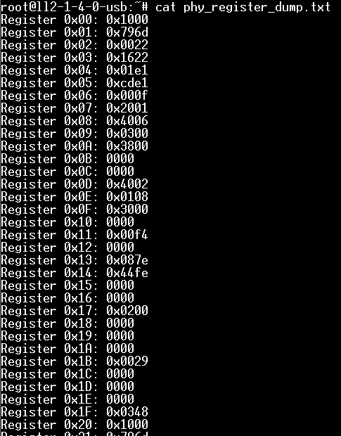
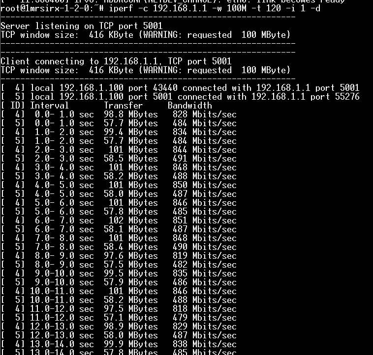
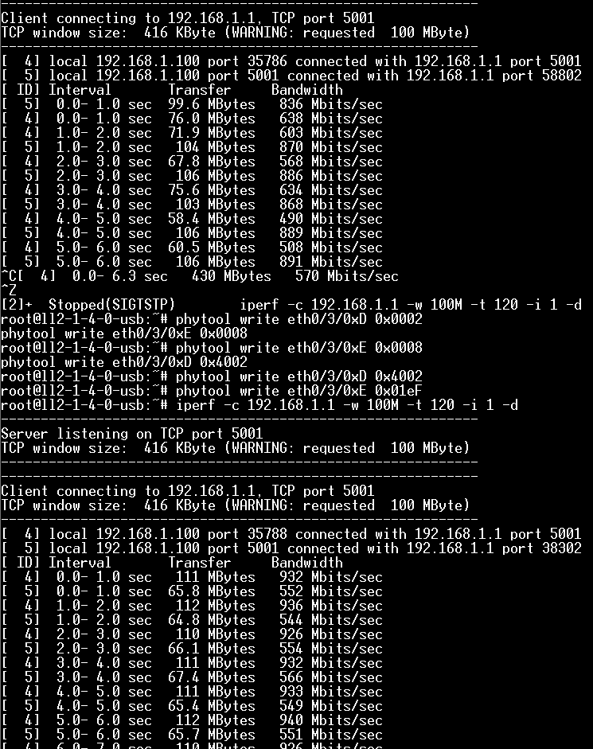

```
fatload usb 0:1 0x10000000 image.ub;bootm 0x10000000;

iperf -c 192.168.1.1 -w 100M -t 10 -i 1 -d

ethtool -S eth0 | grep err

ping 192.168.1.1

phytool write eth0/3/0xD 0x0002
phytool write eth0/3/0xE 0x0008
phytool write eth0/3/0xD 0x4002
phytool read eth0/3/0xE

phytool write eth0/3/0xD 0x0002

phytool write eth0/3/0xE 0x0008

phytool write eth0/3/0xD 0x4002

phytool write eth0/3/0xE 0x01eF

```

device tree skew 公式
495 -> 0x0108
495 / 60 = 8 = 0x8
(0x8 & 0x1F) << 5 + (0x8 & 0x1F) << 0 = 0x0108

0x3E2F -> 0x0129
0x3E2F = 15109
15109/60 = 265 = 0x109
(0x0109 & 0x1F) << 5 + (0x0109 & 0x1F) << 0 = 0x0129

tx = 0x528  skew +420ps
rx = 0x384  skew 0ps

0x528 = 1,320
1,320/60 = 22 = 0x16

0x384 = 900
900/60 = 15 = 0xF

( 0x16 & 0x1F) << 5 + (0xF & 0x1F) << 0 = 0x02cf

[TOC]

# OK
## 07


## 08


# 半通
# 02

## 06
# 不通
## 10



## 05



# 瑞士


# 07


