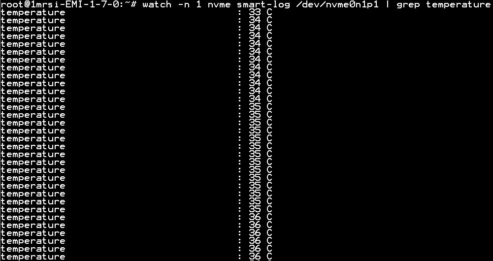
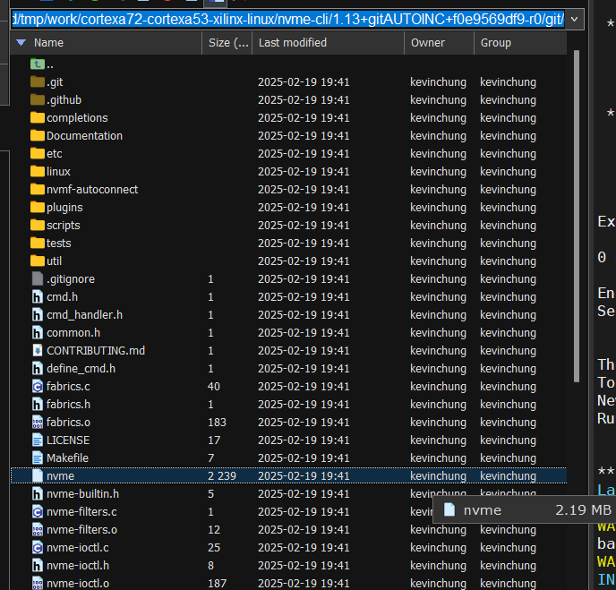

# 使用方法範例
- 查看目前 SSD 溫度

```
watch -n 1 nvme smart-log /dev/nvme0n1p1 | grep temperature
```


# 編譯方法
1. 使用以下指令下載原始碼到編譯資料夾
```
cd </path/to/your/patelinux_project_root_dir>
mkdir delme
cd delme
git clone https://github.com/linux-nvme/nvme-cli
tar czvf git2_github.com.linux-nvme.nvme-cli.git.tar.gz -C nvme-cli/.git/ .
mv git2_github.com.linux-nvme.nvme-cli.git.tar.gz <patelinux_project_root_dir/build/downloads>
cd ..
rm -rf delme
```

2. 編譯出執行檔
```
petalinux-build -c nvme-cli -x compile
```

3. 撈出執行檔 `nvme` 下載到Patelinux中執行
```
cd <patelinux_project_root_dir/build/tmp/work/cortexa72-cortexa53-xilinx-linux/nvme-cli/1.13+gitAUTOINC+f0e9569df9-r0/git/>
```

